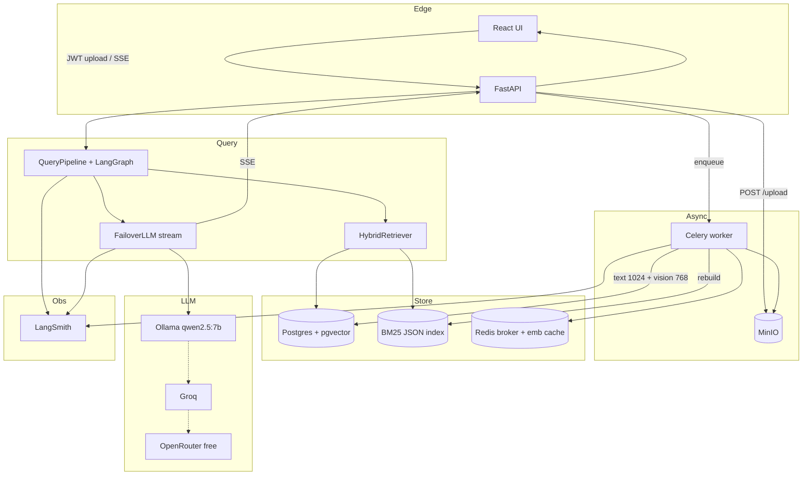
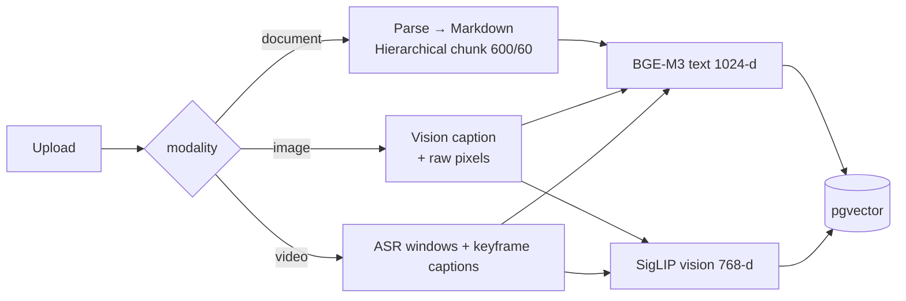

# Aegis Backend

Production multimodal RAG API: **ingest anything → hybrid retrieve → stream grounded answers**.

This document explains **how the backend is designed and why**. Deeper module READMEs live next to the code.

| Module README | What it covers |
|---------------|----------------|
| [`app/api/`](app/api/README.md) | HTTP surface, upload/query contracts |
| [`app/pipelines/`](app/pipelines/README.md) | Ingestion + query orchestration |
| [`app/ingestion/`](app/ingestion/README.md) | Parsing → **chunking** (documents) |
| [`app/services/`](app/services/README.md) | Embeddings, parse, video, ASR, vision, scope |
| [`app/embeddings/`](app/embeddings/README.md) | Legacy wrappers vs live `EmbeddingService` |
| [`app/retrieval/`](app/retrieval/README.md) | BM25 + pgvector + RRF + rerank |
| [`app/rag/`](app/rag/README.md) | Context assembly + LLM generation/stream |
| [`app/workflow/`](app/workflow/README.md) | LangGraph topology + temporal NL |
| [`app/guardrails/`](app/guardrails/README.md) | Input / output / ingest guards |
| [`app/tasks/`](app/tasks/README.md) | Celery job lifecycle |
| [`app/db/`](app/db/README.md) | Schema: artifacts, vectors, temporal metadata |
| [`app/models/`](app/models/README.md) | Ollama / Groq LLM wrappers |

Operator runbook: [`../docs/GUIDE.md`](../docs/GUIDE.md)

---

## Auth & chat-scoped retrieval

Aegis isolates RAG context **per chat**, not by putting each user in a separate vector database.

| Piece | Behavior |
|-------|----------|
| Auth | `POST /auth/signup`, `POST /auth/login`, `GET /auth/me` — email + password, JWT Bearer |
| Chats | `GET/POST /chats`, `GET/DELETE /chats/{id}` — sidebar history |
| Upload | Requires auth + `session_id` form field; sets `Artifact.user_id` + `session_id` |
| Query | Requires auth + `session_id`; retrieves **only** completed embeddings for that chat |

```text
User → Chat A (pdf1) → vectors filtered by artifact_ids ∈ Chat A
     → Chat B (pdf2) → never sees pdf1
```

Env: `JWT_SECRET`, `JWT_EXPIRE_DAYS` (see `.env.example`).

Migrate: `alembic -c backend/alembic.ini upgrade head`

---

## Design principles

1. **Grounding first** — answers must come from uploaded artifacts; empty/weak context refuses or hedges.
2. **Async ingest, sync-ish query** — uploads never block the API; queries block until embeddings exist for scoped artifacts.
3. **Dual vector spaces** — lexical/semantic text (**BGE-M3, 1024-d** → `embedding_text`) and cross-modal vision (**SigLIP, 768-d** → `embedding_vision`) with per-column HNSW indexes; legacy `embedding` kept for dual-read.
4. **Modality-specific chunking** — documents ≠ images ≠ video. Each path builds different “atomic units” before embedding.
5. **Cloud for heavy multimodal I/O, local for embeds** — Groq Whisper/Vision for captions/ASR; SentenceTransformers/OpenCLIP for vectors (GPU if available).
6. **Hybrid recall then precision** — BM25 ∪ dense → RRF → cross-encoder rerank.

---

## System topology

Full PNG: [`../docs/assets/aegis-system-architecture.png`](../docs/assets/aegis-system-architecture.png) · [`../docs/architecture.md`](../docs/architecture.md)



---

## How chunking & embedding work (by modality)

Documents, images, and video **do not share one chunker**. That is intentional.



### Documents

| Step | Implementation | Why |
|------|----------------|-----|
| Parse | LiteParse → Markdown (`parsing_service`) | Headings/tables/images preserved as structure |
| Chunk | `MarkdownHierarchicalChunker` — Markdown nodes → `SentenceSplitter(600, overlap=60)` | Structure-aware + sentence-safe; overlap keeps boundary context |
| Filter | Merge chunks &lt; **120** substantive chars | Avoid date-only / bare-header noise in ANN |
| Cap | `MAX_INGEST_CHUNKS` default **200** | Bound cost per file |
| Embed | `EmbeddingService.embed_text` (BGE-M3) | Multilingual dense retrieval |
| Extra | Page/image renders may also get SigLIP rows | Cross-modal “find this figure” |

### Images

| Step | Implementation | Why |
|------|----------------|-----|
| Caption | Groq vision → structured description + OCR-ish text | Lexical searchable summary |
| Embed A | SigLIP on **pixels** (`embedding_type=vision`) | Cross-modal query (“red car”) matches image space |
| Embed B | BGE-M3 on **caption text** (`embedding_type=text`) | BM25 + dense text still work if vision path misses |

### Video

| Step | Implementation | Why |
|------|----------------|-----|
| ASR | Groq Whisper → ~**30s** spoken windows | Speech is dense evidence; windows = good RAG chunk size |
| Keyframes | Every **8s**, scene-diff filter, max **20** | Dense enough for objects without blowing vision quota |
| Caption | Groq vision, object-forward prompt | Cars/people/text become retrieval nouns |
| Merge | ASR windows + **all** captions (visual-only rows kept) | Object Q&A must not depend on speech mentioning the object |
| Embed | BGE on segment text; SigLIP if `frame_path` exists | Temporal + multimodal recall |
| Metadata | `artifact_metadata.key=temporal` with `start_time`/`end_time` | NL time queries (`at 10s`) |

Details: [`app/ingestion/README.md`](app/ingestion/README.md) (text · image · video workflows) · [`app/services/README.md`](app/services/README.md)

---

## Query path (why two retrieval modes)

```text
InputGuard
  → resolve artifact_ids / ensure vectors ready
  → _detect_time(query)?
        YES → SQL overlap on temporal metadata (±8s pad for point times)
        NO  → BM25 ∪ dense text ∪ dense vision → RRF → bge-reranker → top-k
  → ContextBuilder
  → stream_generate (native LLM tokens)  OR  structured generate (/query)
  → OutputGuard
```

| Mode | When | Why separate |
|------|------|--------------|
| Temporal | Query mentions times | Semantic ANN is bad at “second 10”; metadata filter is exact |
| Hybrid | Everything else | Maximize recall across speech captions, docs, frames |

---

## Run locally

```bash
# from repo root
docker compose up -d
cp .env.example .env   # fill keys / passwords

python -m venv venv
# activate venv
pip install -r backend/requirements.txt

uvicorn backend.app.main:app --reload --reload-dir backend
celery -A backend.app.worker.celery_app worker --loglevel=info
```

- OpenAPI: `http://127.0.0.1:8000/docs`
- Health: `GET /health`

---

## Package layout

```text
backend/
├── app/
│   ├── main.py              # FastAPI lifespan (BM25 rebuild, vision warm-up)
│   ├── worker.py            # Celery entry
│   ├── api/                 # HTTP
│   ├── pipelines/           # Ingest + query orchestration
│   ├── ingestion/           # Loaders + chunkers
│   ├── services/            # Embed, parse, video, ASR, vision, scope
│   ├── embeddings/          # Older model wrappers (see README)
│   ├── retrieval/           # Hybrid stack
│   ├── rag/                 # Prompt + generate
│   ├── workflow/            # LangGraph
│   ├── guardrails/
│   ├── tasks/               # Celery jobs
│   ├── db/
│   ├── models/              # LLM clients
│   ├── monitoring/
│   └── core/                # config, exceptions, middleware
├── alembic/                 # Migrations (pgvector, unbounded dims, …)
├── requirements.txt
└── README.md                # ← you are here
```

---

## Why not one shared pipeline?

| Temptation | Why we avoided it |
|------------|-------------------|
| Fixed-size char chunks for everything | Breaks tables/headings; bad for video timestamps |
| Single embedding model | Text ANN ≠ image ANN; SigLIP and BGE optimize different spaces |
| Sync vision in the API process | Timeouts + GPU/API rate limits; Celery isolates failure/retry |
| Only ASR for video | Object questions fail when speech never says “car” |
| Only captions for video | Loses spoken detail and timestamps from Whisper |

Architecture follows **evidence type** (prose / pixels / speech+frames), not a single abstraction that papers over modality differences.
