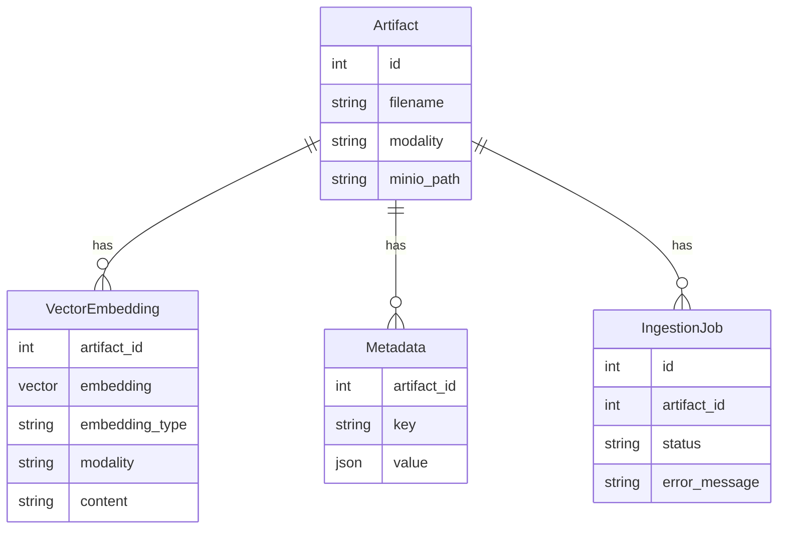

# Database

**Path:** `backend/app/db/`

SQLAlchemy models + engine. Migrations live in `backend/alembic/`.

| File | Role |
|------|------|
| `database.py` | Engine / `SessionLocal` from `DATABASE_URL` |
| `models.py` | ORM entities |

---

## Core entities for RAG

### Why unbounded `Vector()`?

BGE-M3 is **1024-d**; SigLIP is **768-d**. A fixed `vector(1024)` column rejected vision rows. Unbounded pgvector + `embedding_type` discriminator keeps one table.

### Metadata keys that matter

| `key` | Value shape | Used by |
|-------|-------------|---------|
| `temporal` | `{start_time, end_time, content, …}` | Time-range video queries |
| `vision_caption` | caption string / struct | Image audit / debug |

---

## Design rules

1. Always delete vectors when deleting artifacts (no orphans).  
2. Scope retrieval by `artifact_id`, never by filename alone.  
3. Job status is the UI source of truth for “Ready”.
