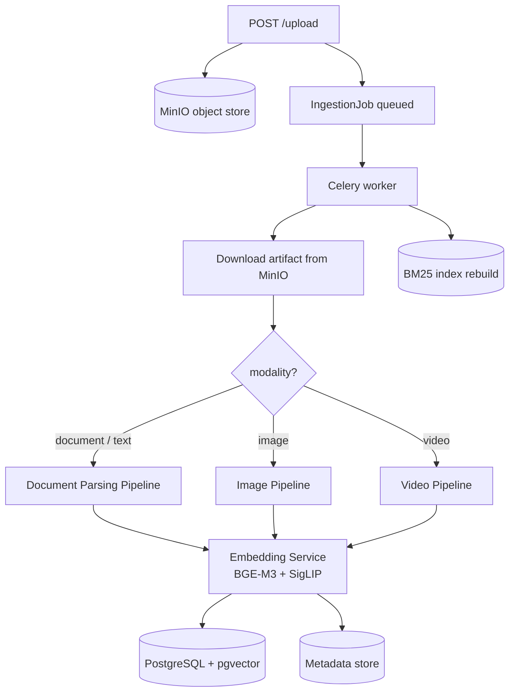
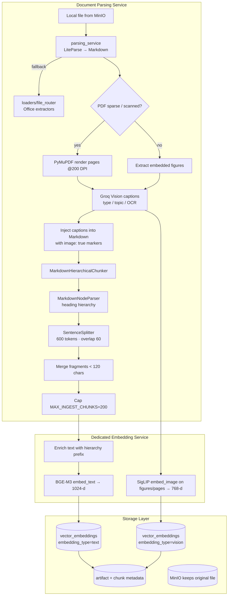
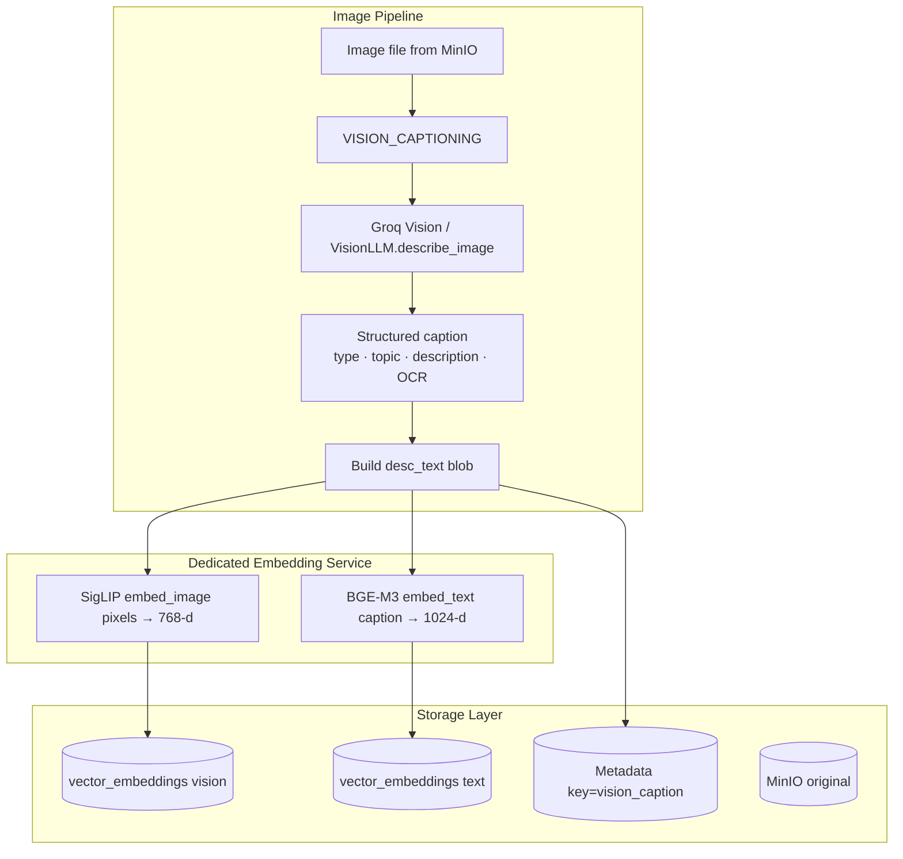
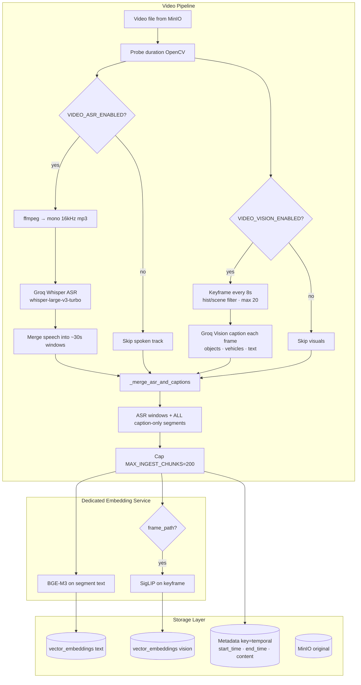
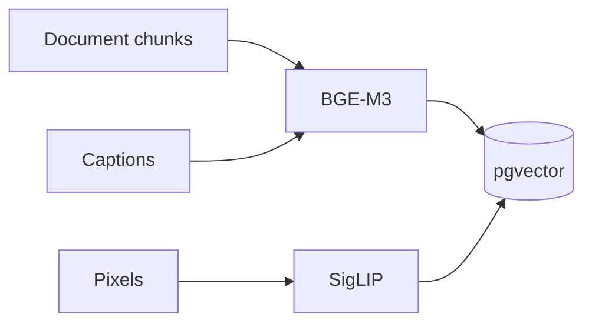

# Ingestion — multimodal workflows

**Path:** `backend/app/ingestion/` (+ orchestration in [`pipelines/`](../pipelines/README.md), modality IO in [`services/`](../services/README.md))

Aegis does **not** use one shared chunker for every file type. Text, images, and video each have their own pipeline — same idea as the reference architecture: separate modality lanes → dedicated embedding service → storage.


> Reference diagram (Ingestion Layer → Embedding Service → Storage). Below is how **Aegis implements** the text / image / video lanes today. Standalone audio is folded into the **video** lane via Whisper ASR (no separate audio artifact modality yet).

---

## Ingestion layer (big picture)



| Lane | Code entry | Atomic unit before embed |
|------|------------|--------------------------|
| **Text / documents** | `_process_document` + `MarkdownHierarchicalChunker` | Hierarchy-aware Markdown chunks |
| **Image** | `_process_image` | Whole-file caption + pixels |
| **Video** | `_process_video` + `VideoService` | Timed ASR windows + keyframe captions |

Shared stages notified to the UI: `PARSING` → `VISION_CAPTIONING` → `CHUNKING_EMBEDDING` → `STORING`.

---

## 1. Document / text pipeline

**Goal:** Turn PDF / DOCX / PPTX / XLSX / TXT into searchable text vectors (and optional page/figure vision vectors).



### Step table

| Step | What happens | Why |
|------|----------------|-----|
| 1. Parse | LiteParse → Markdown (LibreOffice for Office) | One structure for all doc types |
| 2. Vision assist | Caption figures; render scanned PDF pages | Certificates / image-heavy PDFs have little extractable text |
| 3. Chunk | Hierarchy → 600/60 sentence split → merge tiny | Structure-aware ANN units; no date-only noise |
| 4. Embed text | BGE-M3 on `hierarchy + body` | Dense + BM25 recall |
| 5. Embed vision | SigLIP on page/figure images when present | “What does this chart show?” style queries |
| 6. Store | pgvector rows + original in MinIO | Dual space, one artifact_id |

### Chunk metadata example

```json
{
  "document_name": "report.pdf",
  "hierarchy": "Section > Revenue",
  "contains_table": true,
  "contains_image": true
}
```

**Package ownership:** parsing + chunking live here / in `services/parsing_service`; orchestration + DB writes in `pipelines/ingestion_pipeline.py`.

---

## 2. Image pipeline

**Goal:** Index a standalone image so both **pixel similarity** and **caption wording** retrieve it.



### Step table

| Step | What happens | Why |
|------|----------------|-----|
| 1. Caption | Groq vision → type / topic / description / OCR | Lexical + BM25 path needs words |
| 2. Vision embed | SigLIP on raw pixels | Cross-modal queries (“red sports car”) |
| 3. Text embed | BGE-M3 on caption blob | Same hybrid stack as documents |
| 4. Store | Two vector rows + `vision_caption` metadata | One modality, two evidence channels |

**Why dual embed?** Text-only misses visual similarity; vision-only misses OCR strings and topic labels. The reference architecture’s “Image Pipeline → Embedding Service” is exactly this fork.

**No hierarchical chunker** — the atomic unit is the whole image (+ its caption).

---

## 3. Video pipeline

**Goal:** Build **time-addressable** searchable segments from speech + sparse keyframes (reference: Video Pipeline + audio transcription inside the same lane).



### Step table

| Step | What happens | Why |
|------|----------------|-----|
| 1. ASR | Whisper timed segments → ~30s windows | Spoken evidence; good RAG chunk size |
| 2. Keyframes | Interval 8s, scene-diff, max 20 | Dense enough for objects without burning vision quota |
| 3. Caption | Object-forward vision prompt | Cars/people become retrieval nouns |
| 4. Merge | Windows get in-range captions; **unused captions kept as own rows** | Object Q&A must not require speech to say “car” |
| 5. Embed | BGE on text; SigLIP if frame kept | Multimodal + temporal recall |
| 6. Temporal meta | `start_time` / `end_time` on each segment | Powers `at 10s` / `first minute` queries |

### Segment text shape

```text
[Video: clip.mp4] t=0–28
Spoken: …
Visual:
At 8s: …
At 16s: …
```

### Degradation

| Failure | Behavior |
|---------|----------|
| Vision 429 | ASR-only if speech exists (retryable otherwise) |
| Missing ffmpeg | Non-retryable (ASR audio extract required when ASR on) |
| Zero segments | Non-retryable — nothing to search |

**Package ownership:** `services/video_service.py`, `groq_asr_service.py`, `groq_vision_service.py`; persist in `_process_video`.

---

## Embedding service (shared)

All three lanes converge here — matching the reference “Dedicated Embedding Service”.

| Encoder | Model | Dim | Consumers |
|---------|-------|-----|-----------|
| Text | `BAAI/bge-m3` | 1024 | Doc chunks, image captions, video segment text |
| Vision | `ViT-B-16-SigLIP` | 768 | Images, PDF pages/figures, video keyframes |
| Cache | Redis DB 2 | — | `emb:{version}:{model}:{md5}` · TTL 24h |



---

## Storage layer (after embed)

| Store | What lands there |
|-------|------------------|
| **MinIO** | Original bytes (source of truth for reprocess) |
| **PostgreSQL + pgvector** | `vector_embeddings` (`text` / `vision`) |
| **Metadata** | `vision_caption`, `temporal`, chunk hints |
| **BM25 JSON** | Rebuilt from text embeddings after job success |

No separate graph DB in production yet (shown as optional in the reference diagram).

---

## Layout (this package)

```text
ingestion/
├── loaders/                 # Document fallback extractors
│   ├── file_router.py
│   ├── pdf_loader.py · docx · ppt · excel · text
├── chunking/
│   ├── markdown_chunker.py  # ★ production document chunker
│   └── semantic_chunker.py  # unused on Celery path
└── experimental/            # R&D chunkers only
```

Image & video **workflows** are documented above but implemented under `services/` + `pipelines/` — by design (IO/models vs chunk algorithms).

---

## Design rules

1. **One modality → one atomic unit type** (chunk ≠ caption ≠ timed segment).  
2. Always write through **Embedding Service**, never ad-hoc model loads in the API.  
3. Keep **originals in MinIO**; vectors are derived and disposable/rebuildable.  
4. Cap units (`MAX_INGEST_CHUNKS`) on **document and video** paths.  
5. Prefer dual text+vision rows when pixels exist — matches hybrid retrieval later.
