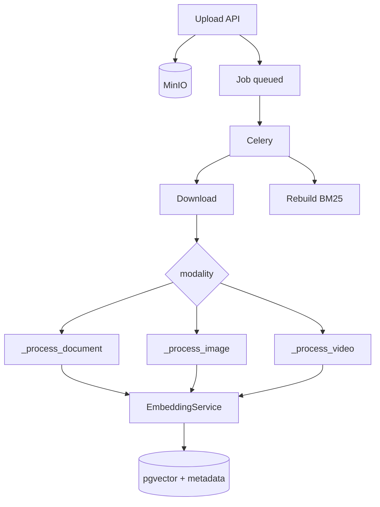

# Pipelines

**Path:** `backend/app/pipelines/`

End-to-end orchestration. Pipelines **call** services/retrieval/rag; they should not reimplement modality math.

| File | Role |
|------|------|
| `ingestion_pipeline.py` | Document / image / video ingest stages → DB |
| `query_pipeline.py` | Sync `answer()` + stream `stream_answer()` |

**Full modality workflows (text · image · video):** see [`../ingestion/README.md`](../ingestion/README.md) — reference-style diagrams for each lane.

---

## IngestionPipeline — why stage machines?

Celery needs **retryable stages** with clear failure points (`PARSING` → `VISION_CAPTIONING` → `CHUNKING_EMBEDDING` → `STORING`). Each stage maps to `ProcessingStatus` for the UI job poller.

### Per-modality embedding (summary)

| Modality | Method | Chunk / unit | Text embed | Vision embed | Metadata |
|----------|--------|--------------|------------|--------------|----------|
| Document | `_process_document` | Markdown 600/60 | BGE | Optional pages/figures | hierarchy / image flags |
| Image | `_process_image` | Whole file + caption | BGE on caption | SigLIP on pixels | `vision_caption` |
| Video | `_process_video` | ASR windows + captions | BGE on segment | SigLIP if frame | `temporal` |

**Why enrich document text with hierarchy before embed?**  
Dense models overweight leading tokens; putting `Section > Title` up front improves section-aware retrieval.

**Why dual-embed images?**  
Lexical questions hit caption text; visual questions hit SigLIP space.

---

## QueryPipeline — two execution modes

| Mode | Entry | Graph? | Generation |
|------|-------|--------|------------|
| Blocking | `POST /query` → `answer()` | Yes — LangGraph | Structured `StructuredAnswer` when supported |
| Streaming | `POST /query-stream` → `stream_answer()` | No — inline retrieve | Native `llm.stream()` plain text |

**Why stream path skips LangGraph?**  
Lower overhead and direct token yield to `StreamingResponse`. It still reuses `_detect_time`, hybrid retriever, guards, and the same generator.

Stream temporal behavior:

1. Detect time → pad point queries  
2. `query_time_range`  
3. If empty → **fallback hybrid**  
4. Focus instruction when `focus` present  

---

## Design rules

1. Pipelines own **transactions and stage notifications**, not model prompts.  
2. Never query before `ensure_query_ready` for scoped artifacts.  
3. Cap chunks (`MAX_INGEST_CHUNKS`) in **both** document and video loops.  
4. On success, Celery rebuilds BM25 — pipeline persists vectors only.
