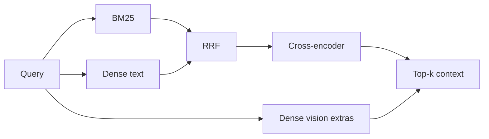

# Retrieval

**Path:** `backend/app/retrieval/`

Hybrid search stack: **recall wide, then rank precise**.

| File | Role |
|------|------|
| `hybrid_retriever.py` | Orchestrates BM25 + dense + multimodal extras + RRF + rerank |
| `pgvector_store.py` | ANN over Postgres; temporal SQL; picks BGE vs SigLIP by `embedding_type` |
| `bm25_store.py` | Sparse lexical index (persisted JSON); rebuilt after ingest |
| `reranker.py` | `BAAI/bge-reranker-v2-m3` cross-encoder |
| `quality_assessor.py` | Retrieval quality helpers |
| `fusion.py` | Legacy stub — **not** on the live hybrid path |

---

## Why hybrid?

| Signal | Catches | Misses |
|--------|---------|--------|
| BM25 | Exact tokens, IDs, rare names | Paraphrase |
| Dense (BGE) | Paraphrase / semantics | Exact rare strings sometimes |
| Dense vision (SigLIP) | “red car”, visual similarity | Pure lexical doc queries |
| Reranker | Fine pairwise relevance | Cost — so only top candidates |

RRF (Reciprocal Rank Fusion) merges ranked lists without calibrating raw scores across models.



Defaults (`core/config.py`):

| Knob | Default | Why |
|------|---------|-----|
| `RETRIEVAL_TOP_K` | 20 | Over-fetch for fusion |
| `RERANKER_TOP_K` | 5 | Fit LLM context; cut noise |
| `RRF_K` | 60 | Standard RRF constant |
| Weights | ~0.4 BM25 / 0.6 dense (adaptive) | Dense usually stronger on prose |

---

## Artifact scoping

When the UI passes `artifact_ids`:

1. BM25 over-fetches then filters  
2. Dense search includes **all modalities** for those artifacts  
3. Explicit video text + video vision searches are merged  

**Why:** A chat session should not leak another user’s/file’s chunks, and video evidence is often under-represented if only `modality=document` is searched.

---

## Temporal retrieval

Not ANN — SQL on `artifact_metadata` where `key='temporal'`:

```sql
start_time <= :end AND end_time >= :start
```

Point queries arrive pre-padded (±8s) from `_detect_time`. See [`../workflow/README.md`](../workflow/README.md).

**Why separate from hybrid?** “At 10 seconds” is a metadata predicate, not a semantic neighbor of the word “ten”.

---

## pgvector row shape

| Column / field | Purpose |
|----------------|---------|
| `embedding` | Unbounded `Vector()` — 1024 or 768 |
| `embedding_type` | `text` \| `vision` — selects query encoder |
| `modality` | document / image / video |
| `artifact_id` | Scope + cleanup |

**Why unbounded dims?** One table serves BGE and SigLIP without dual schemas. Migration removed fixed `vector(1024)`.

---

## Design rules

1. Always fuse then rerank — never return raw BM25-only to the LLM in production.  
2. Never compare BGE vectors to SigLIP vectors.  
3. Rebuild BM25 after successful ingest (Celery success hook).  
4. Prefer raising `top_k` before weakening the reranker.
