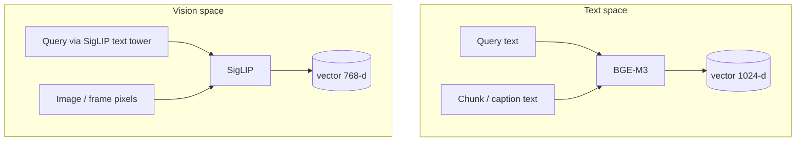
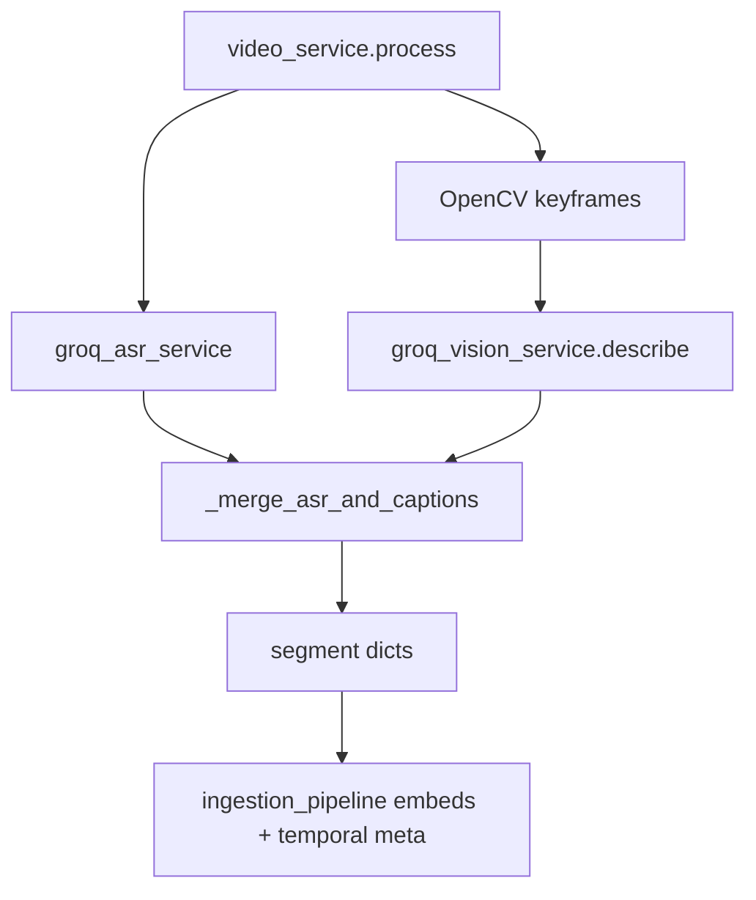

# Services

**Path:** `backend/app/services/`

Runtime services used by Celery ingest and the query path. This is where **modality-specific IO** lives.

> **Ingestion lane workflows (diagrams):** [`../ingestion/README.md`](../ingestion/README.md) — Document / Image / Video pipelines → Embedding Service → Storage (aligned with the architecture reference).

| Service | File | Responsibility |
|---------|------|----------------|
| Embedding | `embedding_service.py` | BGE-M3 + SigLIP (+ Redis cache) |
| Parsing | `parsing_service.py` | Bytes → Markdown |
| Video | `video_service.py` | Timed segments from ASR + frames |
| ASR | `groq_asr_service.py` | ffmpeg → Whisper |
| Vision (cloud) | `groq_vision_service.py` | Frame/image captions |
| Vision (local) | `vision_service.py` | LLaVA — **not** on production ingest |
| Query scope | `query_scope.py` | Which artifacts may be searched |

---

## Why services are split this way

```text
pipelines/   →  what to do (stages, DB writes)
services/    →  how to do modality work (IO, models, merge rules)
ingestion/   →  document chunk algorithms + workflow docs
```

Pipelines stay thin. Services can be swapped (Groq ↔ local) without rewriting Celery tasks.

---

## EmbeddingService — dual encoders

**File:** `embedding_service.py` (process singleton)

| Encoder | Model | Dim | Used for |
|---------|-------|-----|----------|
| Text | `BAAI/bge-m3` | **1024** | Document chunks, captions, video segment text, query (text search) |
| Vision | `ViT-B-16-SigLIP` (`webli`) | **768** | Images, video keyframes, query-for-vision |



**Why two models?**  
Cosine search is only meaningful inside one embedding space. Rows store `embedding_type ∈ {text, vision}`; `PgVectorStore` picks the matching query encoder.

**Why Redis cache (DB 2)?**  
Identical captions/chunks reappear across retries and near-duplicate frames. Key: `emb:{version}:{model}:{md5}` · TTL 24h.

---

## ParsingService — documents only

**File:** `parsing_service.py`

```text
PDF/DOCX/PPTX/XLSX/TXT → LiteParse (LibreOffice bridge for Office) → Markdown
                         ↘ fallback: ingestion/loaders/*
```

**Why Markdown?** Downstream hierarchical chunker needs headings/tables. Full document workflow: [`../ingestion/README.md#1-document--text-pipeline`](../ingestion/README.md#1-document--text-pipeline).

---

## Video stack — implementation notes

Full workflow diagram: [`../ingestion/README.md#3-video-pipeline`](../ingestion/README.md#3-video-pipeline).



### GroqASRService

| Detail | Value | Why |
|--------|-------|-----|
| Audio extract | ffmpeg mono 16 kHz mp3 | Whisper-friendly, small |
| Model | `whisper-large-v3-turbo` | Speed / cost on Groq |
| Large files | Chunk ~600s if &gt;24MB | API payload limits |
| Output | `{start, end, text}` | Feeds window merge |

### GroqVisionService

| Detail | Value | Why |
|--------|-------|-----|
| Resize | max 512px JPEG q75 | Payload + latency |
| Prompt | 2–3 sentences, name vehicles/objects/text | Object Q&A needs nouns |
| `max_tokens` | ~220 | Room for concrete detail |
| Workers | 2 parallel captions | Soft rate-limit safety |

### VideoService merge rules (critical)

| Rule | Why |
|------|-----|
| Merge ASR into ~**30s** windows | Good RAG chunk size |
| Attach **all in-window** captions | Multi-event windows keep every visual |
| **Keep unused captions as their own segments** | Object Q&A without speech mentioning the object |
| Pad caption-only `start = ts-2` | Point temporal queries still hit |
| Cap keyframes (`VIDEO_MAX_KEYFRAMES`, default 20) | Vision API budget |

On 429 vision: degrade to ASR-only if speech exists.

---

## Query scope

**File:** `query_scope.py`

| Behavior | Why |
|----------|-----|
| Resolve `artifact_ids` or default to latest completed | UI scopes chat to ready uploads |
| Block query while job in-flight / no vectors | Prevents empty or half-indexed answers |

---

## Local `vision_service.py` (LLaVA)

Kept for offline experiments. **Production ingest uses GroqVisionService**.

---

## Design summary

| Modality | Atomic unit | Text embed | Vision embed | Extra |
|----------|-------------|------------|--------------|-------|
| Document | Markdown chunk 600/60 | ✓ | optional page images | hierarchy metadata |
| Image | Whole file | caption text | pixels | `vision_caption` metadata |
| Video | Time window / keyframe | segment text | keyframe if present | `temporal` metadata |
