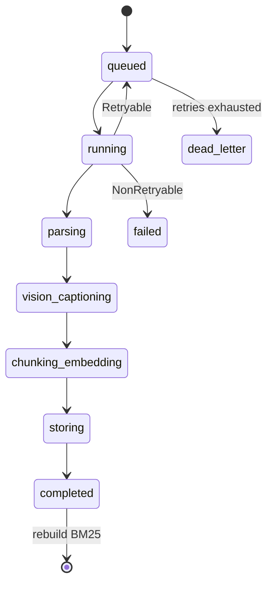

# Tasks (Celery)

**Path:** `backend/app/tasks/`

Async execution for multimodal ingest.

| File | Role |
|------|------|
| `ingestion_tasks.py` | `process_ingestion_task`, stuck-job cleanup |

Worker entry: `backend/app/worker.py` · queue `ingestion_queue` · Redis broker DB **1**.

---

## Why Celery (not FastAPI BackgroundTasks)?

| Requirement | Celery |
|-------------|--------|
| Survive API restart | ✓ |
| Retry with backoff | `max_retries=3`, `2**n * 5` |
| Horizontal workers | ✓ |
| Dead letter after exhaustion | ✓ |
| Heartbeat / stuck cleanup | `cleanup_stuck_jobs` (~15 min) |

---

## Lifecycle

On **success**: rebuild `BM25Store` from Postgres text embeddings so sparse search sees new chunks immediately.

---

## Error taxonomy (`core/exceptions.py`)

| Type | Example | Behavior |
|------|---------|----------|
| `RetryableIngestionError` | Groq 429, transient network | Retry / backoff |
| `NonRetryableIngestionError` | Bad file, unsupported type | `failed` |

---

## Design rules

1. Tasks accept **`job_id` only** — reload artifact paths from DB/MinIO.  
2. Notify stage transitions for UI polling.  
3. Never embed inside the API process for production uploads.
