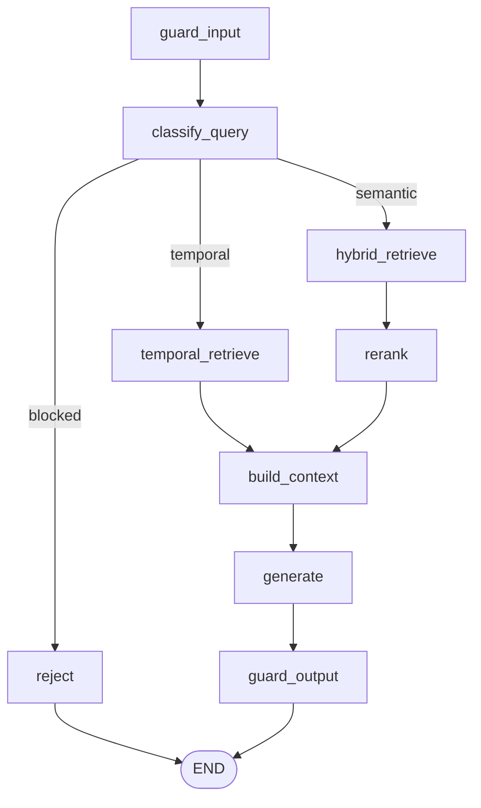

# Workflow (LangGraph)

**Path:** `backend/app/workflow/`

Deterministic RAG state machine for the **blocking** query path.

| File | Role |
|------|------|
| `graph.py` | Compiles `StateGraph` |
| `nodes.py` | Node functions + **`_detect_time`** |
| `state.py` | `OmniMindState` TypedDict (legacy name) |

---

## Topology

**Why LangGraph?** Explicit branching (temporal vs semantic vs blocked), per-node latency, and LangSmith hooks without nested `if` spaghetti in the pipeline.

**Why stream path duplicates retrieve logic?** Streaming needs early `yield`; graph invoke is request/response oriented. Shared primitives (`_detect_time`, retriever, generator) stay single-sourced.

---

## Temporal NL (`_detect_time`)

| Pattern | Example | Result |
|---------|---------|--------|
| Point + pad ±8s | `at 10 second`, `at 10s`, `10th second` | `{start:2,end:18,focus:10}` |
| Range | `between 5 and 20 seconds` | `{5,20}` |
| Prefix | `first minute`, `first 30 seconds` | `{0,60}` / `{0,30}` |
| Clock | `at 1:05` | seconds + pad |

**Why ±8s pad?** Video segments are coarse (~30s ASR / keyframe pads). A zero-width `[10,10]` query still works via overlap SQL, but padding improves hit rate when windows don’t cover the exact second densely.

Shared with `QueryPipeline.stream_answer` — change once, both paths update.

---

## Design rules

1. Nodes return **partial state dicts** only.  
2. Time parsing lives in `nodes.py` — do not fork regexes in the API layer.  
3. Keep `reject` for guard/scope failures instead of raising into FastAPI 500s when possible.
