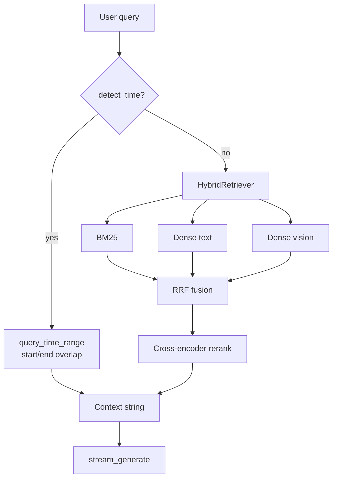

# Aegis Operator Guide

Interactive runbook for developers and demos. Pair with the root [readme](../readme.md) and live OpenAPI at `http://127.0.0.1:8000/docs`.

---

## 0. Auth (required for chat UI)

1. Sign up / log in at the React app (`email` + password ≥ 8 chars).
2. JWT is stored in `localStorage` and sent as `Authorization: Bearer …`.
3. Each **chat** owns its uploads; `/query-stream` only searches that chat’s `artifact_ids`.

```bash
# Signup
curl -s -X POST http://127.0.0.1:8000/auth/signup \
  -H "Content-Type: application/json" \
  -d '{"email":"you@example.com","password":"secret123"}'
```

---

## 1. Boot sequence (checklist)

```text
[ ] docker compose up -d          → Postgres :5433, Redis :6379, MinIO :9000/:9001
[ ] .env filled                   → DB, MinIO, Groq/Ollama, video sampling
[ ] uvicorn backend.app.main:app  → API :8000
[ ] celery worker                 → ingestion actually completes
[ ] npm run dev (frontend/)       → UI :5173
[ ] GET /health                   → 200
```

<details>
<summary><strong>Windows PowerShell — three terminals</strong></summary>

```powershell
# T1 — infra
docker compose up -d

# T2 — API
.\venv\Scripts\activate
uvicorn backend.app.main:app --reload --reload-dir backend

# T3 — worker
.\venv\Scripts\activate
celery -A backend.app.worker.celery_app worker --loglevel=info

# T4 — UI
cd frontend
npm run dev
```

</details>

---

## 2. Interactive API lab

Open **Swagger UI**: [http://127.0.0.1:8000/docs](http://127.0.0.1:8000/docs)

| Try | Endpoint | Expect |
|-----|----------|--------|
| 1 | `GET /health` | OK payload |
| 2 | `POST /upload` (mp4 or pdf) | `job_id`, `artifact_id` |
| 3 | `GET /jobs/{id}` refresh | until `completed` |
| 4 | `POST /query-stream` | tokens in response body |
| 5 | `POST /query` with `evaluate:true` | JSON + optional eval scores |

### Stream in the terminal

```bash
curl -N -X POST http://127.0.0.1:8000/query-stream \
  -H "Content-Type: application/json" \
  -d "{\"query\":\"Summarize what was uploaded\",\"artifact_ids\":[1]}"
```

`-N` disables curl buffering so you see tokens arrive.

---

## 3. Retrieval debugger (mental model)



**If answers feel generic**

1. Job really `completed`? (UI says Ready)  
2. Query scoped to the right `artifact_ids`?  
3. For cars/objects → re-ingest with `VIDEO_MAX_KEYFRAMES≥20`  
4. For timestamps → use `at 10s` / `first minute` (see table below)

---

## 4. Temporal query playground

Paste into the UI after a video is Ready:

| Query | Parsed intent |
|-------|----------------|
| `what happening at 10 second from the start` | focus 10 → window [2, 18] |
| `at 10s` | same |
| `around second 10` | same |
| `10th second` | same |
| `first minute` | [0, 60] |
| `first 30 seconds` | [0, 30] |
| `between 5 and 20 seconds` | [5, 20] |
| `at 1:05` | 65s ± pad |

Point times expand by **±8 seconds** so they overlap ~30s ASR windows and keyframe pads.

<details>
<summary><strong>Python — verify parser locally</strong></summary>

```python
from backend.app.workflow.nodes import _detect_time

print(_detect_time("what happening at 10 second from the start"))
# {'start': 2, 'end': 18, 'focus': 10}

print(_detect_time("What are the cars in this Video?"))
# None  → semantic hybrid path
```

</details>

---

## 5. Video ingest quality knobs

| Symptom | Knob |
|---------|------|
| Misses cars / objects | Raise `VIDEO_MAX_KEYFRAMES`, lower `VIDEO_FRAME_INTERVAL_SEC`, re-upload |
| Vision 429 / rate limit | Lower max keyframes; ASR-only degrade still answers speech questions |
| Temporal answers too vague | Prefer explicit `at Ns`; ensure captions kept (visual-only rows) |
| Upload stuck “Preparing” | Celery worker down or Groq key invalid |

Recommended `.env`:

```env
VIDEO_FRAME_INTERVAL_SEC=8
VIDEO_MAX_KEYFRAMES=20
VIDEO_SCENE_DIFF_THRESHOLD=8
VIDEO_ASR_ENABLED=true
VIDEO_VISION_ENABLED=true
```

---

## 6. UI behavior contract

| Event | UI |
|-------|-----|
| Choose file | Document card in thread — Uploading |
| Job running | Card status + composer chip |
| Job completed | Ready — ask unlocked |
| Send message | User bubble + empty assistant + caret |
| Tokens | Assistant body grows; metadata lines stripped |
| Clear | Messages + ready artifact scope reset |

Backend contract the UI relies on: `uploadFile` → poll `getJobStatus` → `streamQuery(..., artifactIds)`.

---

## 7. Observability

| Tool | How |
|------|-----|
| LangSmith | `LANGCHAIN_TRACING_V2=true` + API key → project `Aegis`. Query traces (`aegis_rag_query`) include child spans: `bm25_retrieve`, `dense_retrieve`, `hybrid_retrieval`, `cross_encoder_rerank`. Ingest traces (`aegis_ingest`) include `document_chunking` with hierarchy samples. |
| Monitor API | `/monitor/stats`, `/monitor/runs` |
| Evaluate | Opt-in RAGAS only (`POST /evaluate*`, `evaluate:true` on `/query`, or CLI scripts) — not at API boot; uses **actual retrieved contexts**; reports in [`docs/eval/`](./eval/) |

---

## 8. Scaling (vector store)

See [vector_storage_migration_path.md](./vector_storage_migration_path.md) for pgvector → replica → dedicated vector DB phases.

---

## 9. Common failures

| Error / symptom | Fix |
|-----------------|-----|
| `Could not find that in the uploaded material` | Weak visual index — re-upload with denser frames; check captions mention the object |
| Upload never Ready | Start Celery; check MinIO/Postgres; read job `error_message` |
| CORS blocked | Add Vite origin to `CORS_ORIGINS` |
| Empty temporal hit | Fallback semantic path should engage; confirm temporal metadata rows exist |
| Ollama stream fails | Falls back to Groq if generation key set |

---

<div align="center">

Next: open the workspace → upload → ask a temporal + an object question → confirm both stream.

</div>
