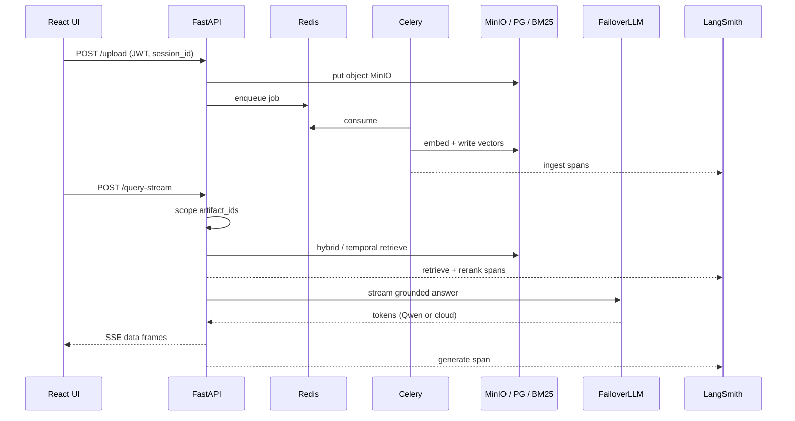

# Aegis system architecture

Combined view of the React client, FastAPI API, Celery ingest, stores, embedding spaces, LLM failover, and monitoring.


System-design style diagram (yellow layers · blue components · parallel modality lanes · storage · LLM failover · LangSmith) mapped to the **actual** Aegis stack — not aspirational Kong/Kafka/Milvus.

Regenerate:

```bash
python scripts/render_architecture_png.py
```

---

## Layers

| Layer | Components | Role |
|-------|------------|------|
| **Client** | React 19 + Vite | JWT auth, chats, in-chat uploads, SSE consumer |
| **API** | FastAPI | `/auth`, `/chats`, `/upload`, `/jobs`, `/query`, `/query-stream`, `/monitor` |
| **Orchestration** | `QueryPipeline` + LangGraph | Guard → classify → temporal \| hybrid → generate → output guard |
| **Async ingest** | Celery + `IngestionPipeline` | Parse / caption / ASR / embed / persist; retry + dead-letter |
| **Stores** | Postgres+pgvector, Redis, MinIO, BM25 JSON | OLTP + vectors, broker/cache, blobs, sparse index |
| **Embeddings** | BGE-M3 (1024), SigLIP (768) | Local dense spaces; Redis cache |
| **Answer LLM** | `FailoverLLM` | **Local Qwen → Groq → OpenRouter `:free`** |
| **Multimodal I/O** | Groq Whisper / Vision | Ingest only; OpenRouter VL free as vision fallback |
| **Observability** | LangSmith | Parent run + chunk / BM25 / dense / RRF / rerank / generate spans |
| **Eval** | RAGAS (opt-in) | Local Qwen judge; never on API boot |

---

## Isolation model

Not multi-DB tenancy. One shared pgvector table; every query resolves:

```text
JWT user_id + session_id → artifact_ids (COMPLETED only) → filter retrieval
```

---

## Embedding spaces

| Space | Model | Dim | Column |
|-------|-------|-----|--------|
| Text semantic | BGE-M3 | 1024 | `embedding_text` |
| Vision / cross-modal | SigLIP | 768 | `embedding_vision` |
| Sparse lexical | BM25 | — | `storage/bm25_index.json` |

---

## LLM call sites

| Call site | When | Provider chain |
|-----------|------|----------------|
| Answer generation / stream | Every query | Ollama Qwen → Groq → OpenRouter `gpt-oss-20b:free` |
| Image / keyframe caption | Ingest | Groq vision → OpenRouter `nemotron-nano-12b-v2-vl:free` |
| Video ASR | Ingest | Groq Whisper (OpenRouter STT only if `OPENROUTER_WHISPER_MODEL` set) |
| RAGAS judge | Opt-in eval | Local Ollama Qwen by default |

---

## Where monitoring happens

LangSmith (`AegisTracer`) attaches to:

1. **Ingest** — `aegis_ingest`, `document_chunking`
2. **Retrieve** — `bm25_retrieve`, `dense_retrieve`, `hybrid_retrieval` (RRF)
3. **Rerank** — `cross_encoder_rerank`
4. **Generate** — LLM generation / stream spans
5. **Parent query run** — correlates the graph

`/monitor/*` exposes runtime aggregates when tracing is enabled.

---

## Workflow mermaid (detail)


