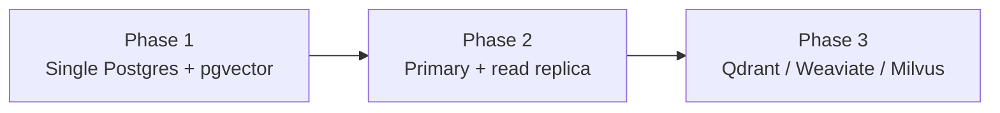

# Vector Storage Scaling & Migration Blueprint

Technical scaling signals and a three-phase migration path for **Aegis** vector storage (PostgreSQL 15 + pgvector).

> Companion to the [Operator Guide](./GUIDE.md) and root [readme](../readme.md).

---

## 1. Contention signals & thresholds

Instrumentation in `PgVectorStore` (`read_latency_ms`) and `IngestionPipeline` (`oltp_write_latency_ms`) surfaces contention before users feel it.

| Metric | Target baseline | Alert threshold | Action |
| :--- | :--- | :--- | :--- |
| `pgvector_read_latency` | < 25 ms | > 150 ms (P95) | HNSW tune or read replica |
| `oltp_write_latency` | < 10 ms | > 100 ms | Isolate vector writes from OLTP hot path |
| Vector row count | < 500k | > 1M | Prepare Phase 3 dedicated cluster |
| Lock contention | 0 deadlocks/min | > 5 lock waits/min | Split ingest writers |

<details>
<summary><strong>Where to look in code</strong></summary>

- `backend/app/retrieval/pgvector_store.py` — ANN search + latency hooks
- `backend/app/pipelines/ingestion_pipeline.py` — embed + insert path
- `/monitor/stats` — runtime aggregates when LangSmith / monitor APIs are enabled

</details>

---

## 2. Three-phase scaling path



### Phase 1 — Current (single instance)

- One Postgres container: OLTP (`artifacts`, `ingestion_jobs`, …) **and** `vector_embeddings`
- Index: IVFFlat or HNSW on embedding cosine ops
- Capacity guide: **~500k** embeddings, **~50** concurrent search QPS
- Also stores **temporal** metadata for video (`artifact_metadata.key = temporal`)

### Phase 2 — Read replica isolation

**Trigger:** P95 vector read > 100 ms, or ingest transactions stall under search load.

| Node | Responsibility |
|------|----------------|
| Primary | OLTP + vector **writes** |
| Replica | Vector **reads** (`<=>` / HNSW) only |

Capacity guide: **~2M** embeddings, **~300** QPS.

### Phase 3 — Dedicated vector DB

**Trigger:** > **2M** vectors, or hard sub-10 ms ANN under parallel ingest.

Candidates: **Qdrant**, **Weaviate**, **Milvus**. Keep Postgres for artifacts/jobs; dual-write or backfill embeddings; point `HybridRetriever` / `PgVectorStore` behind an interface.

<details>
<summary><strong>Migration checklist</strong></summary>

- [ ] Abstract store behind a protocol (search / upsert / delete-by-artifact)
- [ ] Backfill script from `vector_embeddings` + temporal metadata
- [ ] Shadow reads (Postgres vs new store) for one release
- [ ] Cutover dense path; keep BM25 in-process or move to the new engine if supported
- [ ] Revisit Celery batch sizes after cutover

</details>

---

## 3. Video-specific pressure

Dense keyframes (`VIDEO_MAX_KEYFRAMES` × uploads) multiply vision **and** vector rows. Visual-only segments are intentional for object Q&A — budget storage accordingly:

```text
rows ≈ ASR windows + kept keyframes
```

Prefer raising interval before raising max keyframes if MinIO + Postgres disk is the constraint.
