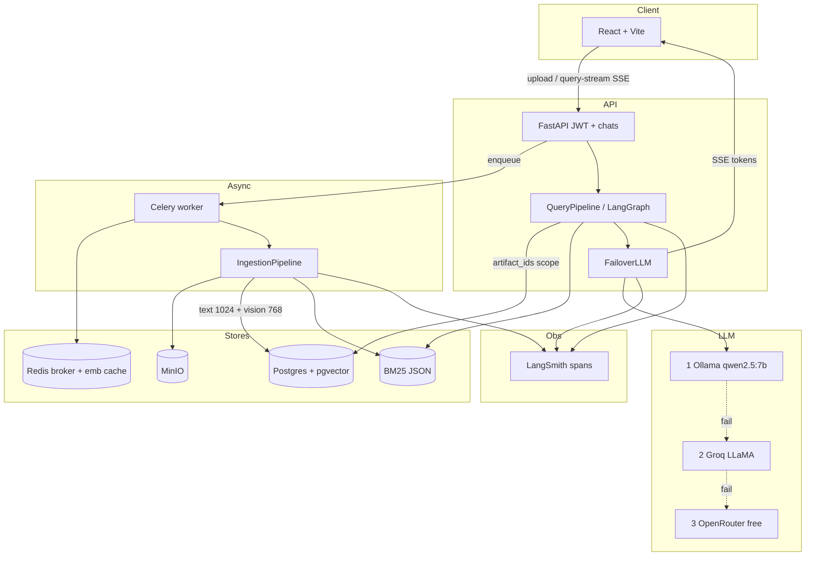

<div align="center">

# Aegis

### Multimodal Hybrid RAG — grounded answers from your files

**Documents · Images · Video · Hybrid retrieval · Guardrails · Live token streaming**

[](https://www.python.org/)
[](https://fastapi.tiangolo.com/)
[](https://react.dev/)
[](https://github.com/pgvector/pgvector)
[](https://redis.io/)
[](https://min.io/)
[](https://groq.com/)
[](https://langchain-ai.github.io/langgraph/)
[](LICENSE)

**[Quick Start](#-quick-start)** ·
**[Try It](#-try-it-interactive)** ·
**[Architecture](#-architecture)** ·
**[API](#-api-reference)** ·
**[Video RAG](#-video-rag-deep-dive)** ·
**[Config](#-configuration)** ·
**[Evaluation](#evaluation-ragas--local-qwen)** ·
**[Docs](docs/)**

</div>

---

## What’s new (v3.x)

| Area | Update |
|------|--------|
| **UI** | React + Vite workspace — warm paper aesthetic, uploads appear **inside the chat** as live status cards |
| **Streaming** | SSE `text/event-stream` on `/query-stream` — native LLM `.stream()` tokens |
| **LLM chain** | Local **Qwen** → Groq → OpenRouter `:free` (`FailoverLLM`) |
| **Observability** | LangSmith spans: chunk / BM25 / dense / RRF / rerank / generate |
| **Video RAG** | Dense keyframes (default **8s / 20 frames**), ASR windows + **every vision caption indexed**, richer object captions |
| **Temporal NL** | `at 10s`, `10th second`, `first minute`, `between 5 and 20 seconds`, `MM:SS` — point queries expand ±8s |
| **Retrieval** | Hybrid **BM25 + dense (+ vision)** → RRF → cross-encoder rerank → guardrails |
| **Storage** | **PostgreSQL + pgvector**, MinIO blobs, Celery ingestion jobs — Chroma/Streamlit are legacy |

<details>
<summary><strong>Why Aegis instead of a general LLM?</strong></summary>

| Capability | ChatGPT-style LLM | Aegis |
|---|:---:|:---:|
| Answers only from *your* uploads | — | ✓ |
| PDF / DOCX / PPTX / XLSX / images / video | — | ✓ |
| Timestamp-aware video Q&A | — | ✓ |
| Hybrid sparse + dense retrieval | — | ✓ |
| Input / output guardrails + confidence trailers | — | ✓ |
| Local Qwen first → Groq → OpenRouter `:free` | — | ✓ |
| SSE token streaming + LangSmith spans | Varies | ✓ |

</details>

---

## Architecture

Full system diagram (PNG): [`docs/assets/aegis-system-architecture.png`](docs/assets/aegis-system-architecture.png) · narrative: [`docs/architecture.md`](docs/architecture.md)



### Request path (query)

```
Query (+ JWT, session_id)
  → InputGuard
  → resolve artifact_ids (this chat only)
  → ensure embeddings ready
  → _detect_time()?
        YES → temporal metadata SQL overlap (±pad)
        NO  → BM25 ∪ dense text ∪ dense vision → RRF → rerank
  → ContextBuilder
  → FailoverLLM.stream  (Qwen → Groq → OpenRouter :free)
  → OutputGuard (grounding / PII)
  → SSE text/event-stream  (JSON /query fallback)
```

### Ingestion path (all modalities)

```
POST /upload → MinIO → Artifact + IngestionJob → Celery (Redis)
  Documents → LiteParse → hierarchical chunk → BGE-M3 → pgvector + BM25
  Images    → Groq vision (→ OpenRouter VL :free) → SigLIP + BGE-M3
  Videos    → Whisper ASR + keyframes + captions → timed segments
            → temporal metadata + dual embeddings
```

<details>
<summary><strong>Stack map (where code lives)</strong></summary>

| Layer | Path | Role |
|-------|------|------|
| HTTP API | `backend/app/api/` | `/upload`, `/jobs/{id}`, `/query`, `/query-stream`, monitor, evaluate |
| Ingestion | `backend/app/pipelines/ingestion_pipeline.py` | Modality routing + persistence |
| Video | `backend/app/services/video_service.py` | ASR merge, keyframes, caption segments |
| ASR / Vision | `groq_asr_service.py`, `groq_vision_service.py` | Whisper + multimodal captions |
| Retrieval | `backend/app/retrieval/` | `HybridRetriever`, `PgVectorStore`, `BM25Store`, reranker |
| Generation | `backend/app/rag/generator.py` | Structured + **streaming** prompts |
| Orchestration | `backend/app/workflow/` | LangGraph nodes; `_detect_time` shared with stream path |
| UI | `frontend/src/` | Landing + Workspace + MessageList document cards |

</details>

---

## Quick Start

### 0. Prerequisites

- Python **3.10+**, Node **18+**
- [Docker](https://www.docker.com/) (Postgres/pgvector, Redis, MinIO)
- [ffmpeg](https://ffmpeg.org/) on `PATH` (video ASR audio extract)
- Optional: [Ollama](https://ollama.ai/) if `USE_LOCAL_LLM=true`

### 1. Clone & env

```bash
git clone https://github.com/Sathvik33/Aegis.git
cd Aegis
cp .env.example .env
# Edit .env — set passwords, Groq keys, USE_LOCAL_LLM, video sampling
```

### 2. Infrastructure

```bash
docker compose up -d
```

| Service | Port |
|---------|------|
| Postgres + pgvector | `5433` |
| Redis | `6379` |
| MinIO API / Console | `9000` / `9001` |

### 3. Backend + worker

```bash
python -m venv venv
# Windows: venv\Scripts\activate
# macOS/Linux: source venv/bin/activate

pip install -r backend/requirements.txt

# API
uvicorn backend.app.main:app --reload --reload-dir backend

# Celery (separate terminal) — required for uploads to finish
celery -A backend.app.worker.celery_app worker --loglevel=info
```

Interactive OpenAPI: [http://127.0.0.1:8000/docs](http://127.0.0.1:8000/docs)

### 4. Frontend

```bash
cd frontend
npm install
cp .env.example .env   # VITE_BACKEND_URL=http://127.0.0.1:8000
npm run dev
```

Open [http://localhost:5173](http://localhost:5173) → **Start a conversation**.

<details>
<summary><strong>Health check one-liner</strong></summary>

```bash
curl -s http://127.0.0.1:8000/health
```

</details>

---

## Try it (interactive)

Use these as a smoke script after upload completes (**Ready — ask away** in chat).

### A. Document

```text
What are the three main claims in this document?
Summarize section 2 in plain language.
```

### B. Video — overview & objects

```text
What is this video representing?
What vehicles or cars are visible, and what color are they?
```

### C. Video — temporal (now parsed + ±8s pad)

| You type | Engine does |
|----------|-------------|
| `what happening at 10 second from the start` | focus `t=10`, search `t∈[2,18]` |
| `at 10s` / `10th second` | same |
| `first minute` | `t∈[0,60]` |
| `between 5 and 20 seconds` | exact range |
| `at 1:05` | MM:SS → seconds + pad |

<details>
<summary><strong>curl — upload → poll → stream</strong></summary>

```bash
# 1) Upload
curl -s -F "file=@./clip.mp4" http://127.0.0.1:8000/upload
# → { "artifact_id": 1, "job_id": 1, ... }

# 2) Poll until completed
curl -s http://127.0.0.1:8000/jobs/1

# 3) Stream (plain text tokens)
curl -N -X POST http://127.0.0.1:8000/query-stream \
  -H "Content-Type: application/json" \
  -d '{"query":"What is happening at 10 seconds?","artifact_ids":[1]}'
```

</details>

<details>
<summary><strong>UI checklist</strong></summary>

- [ ] File card appears in the thread (name, size, ext)
- [ ] Status moves Uploading → Preparing → Ready
- [ ] Ask stays locked until Ready
- [ ] Assistant text grows token-by-token (caret while streaming)
- [ ] Clear resets chat + scoped artifacts

</details>

---

## Video RAG deep dive

Dense visual coverage is required for object questions (“what cars?”). Defaults:

| Variable | Default | Meaning |
|----------|---------|---------|
| `VIDEO_FRAME_INTERVAL_SEC` | `8` | Candidate keyframe step |
| `VIDEO_MAX_KEYFRAMES` | `20` | Cap on vision API calls |
| `VIDEO_SCENE_DIFF_THRESHOLD` | `8` | Skip near-duplicate frames |
| `VIDEO_ASR_ENABLED` | `true` | Groq Whisper segments |
| `VIDEO_VISION_ENABLED` | `true` | Per-keyframe captions |

**Segment model (v3):**

1. ASR merged into ~30s spoken windows  
2. Captions **inside** a window attached as `Visual: At Ns: …`  
3. **Unused keyframes still become their own rows** (visual-only) — so cars/people aren’t dropped when speech never mentions them  
4. Temporal rows stored as `artifact_metadata.key = temporal`

> Re-upload videos after changing sampling env vars — embeddings are built at ingest time.

<details>
<summary><strong>Caption prompt (vision)</strong></summary>

Frames are described with an object-forward prompt (vehicles, colors, people, text, setting) and higher `max_tokens` so retrieval has concrete nouns to match.

</details>

---

## API Reference

Base URL: `http://127.0.0.1:8000`  
Live docs: `/docs` · ReDoc: `/redoc`

### Unified upload

```http
POST /upload
Content-Type: multipart/form-data

file: <pdf|docx|pptx|xlsx|txt|png|jpg|mp4|mov|avi>
```

```json
{
  "message": "File uploaded and task queued.",
  "artifact_id": 1,
  "job_id": 1,
  "minio_path": "..."
}
```

### Job status

```http
GET /jobs/{job_id}
```

```json
{
  "job_id": 1,
  "artifact_id": 1,
  "status": "completed",
  "error_message": null
}
```

Statuses include: `queued` · `running` · `parsing` · `completed` · `failed` · `dead_letter`

### Blocking query

```http
POST /query
Content-Type: application/json
```

```json
{
  "query": "Summarize the uploaded deck",
  "top_k": 3,
  "evaluate": false,
  "artifact_ids": [1]
}
```

Returns answer, confidence, grounding flags, `run_id`, latency, optional RAGAS scores.

### Streaming query

```http
POST /query-stream
Content-Type: application/json
```

```json
{
  "query": "What happens at 10 seconds?",
  "artifact_ids": [1]
}
```

**Response:** `text/plain; charset=utf-8` — raw tokens (not SSE frames).  
Headers: `Cache-Control: no-cache`, `X-Accel-Buffering: no`.

Metadata lines (UI strips these):

```text
[Retrieved: video (72.0% confidence)]
…
[Response confidence: 81.0%]
```

### Ops / eval

| Method | Path | Purpose |
|--------|------|---------|
| GET | `/health` | Liveness |
| GET | `/monitor/health` · `/monitor/stats` · `/monitor/runs` | LangSmith-backed ops |
| POST | `/monitor/feedback` | Run feedback |
| POST | `/evaluate/` · `/evaluate/batch` · `/evaluate/live` | RAGAS-style eval |
| POST | `/feedback/` | Message-level feedback |

---

## Configuration

Copy [`.env.example`](.env.example) → `.env`.

<details>
<summary><strong>LLM routing</strong></summary>

| Variable | Effect |
|----------|--------|
| `USE_LOCAL_LLM=true` (default for local dev) | **Ollama Qwen** → Groq → OpenRouter `:free` |
| `USE_LOCAL_LLM=false` | Groq → OpenRouter `:free` (skip local; demos / low RAM) |
| `GROQ_VISION_*` | Frame / image captions |
| `GROQ_WHISPER_MODEL` | Video ASR |

</details>

<details>
<summary><strong>Infrastructure</strong></summary>

| Variable | Example |
|----------|---------|
| `DATABASE_URL` | `postgresql+psycopg2://…@localhost:5433/omnimind_db` |
| `REDIS_URL` / `CELERY_BROKER_URL` | Redis DB 0 / 1 |
| `MINIO_URL` | `localhost:9000` |
| `APP_ENV` | `development` (default) or `production` — production refuses default JWT/DB/MinIO secrets at boot |
| `JWT_SECRET` | Required strong secret in production |
| `CORS_ORIGINS` | `http://localhost:5173,…` |
| `VITE_BACKEND_URL` | Frontend → API (frontend `.env`) |

</details>

<details>
<summary><strong>Video sampling (recommended)</strong></summary>

```env
VIDEO_FRAME_INTERVAL_SEC=8
VIDEO_MAX_KEYFRAMES=20
VIDEO_SCENE_DIFF_THRESHOLD=8
VIDEO_ASR_ENABLED=true
VIDEO_VISION_ENABLED=true
```

</details>

<details>
<summary><strong>LangSmith observability</strong></summary>

| Variable | Effect |
|----------|--------|
| `LANGSMITH_API_KEY` / `LANGCHAIN_API_KEY` | Enables tracing |
| `LANGCHAIN_PROJECT` | Project name (default `Aegis`) |
| `LANGCHAIN_TRACING_V2` | Set `true` for LangChain auto-tracing extras |

In the LangSmith UI, open a run and expand children:

| Trace | Child spans |
|-------|-------------|
| `aegis_rag_query` | `bm25_retrieve` · `dense_retrieve` · `hybrid_retrieval` (RRF) · `cross_encoder_rerank` (ranked chunk previews + scores) · generation / guardrails |
| `aegis_ingest` | `document_chunking` (chunk counts, hierarchy samples, text previews) |

</details>

---

## Frontend (React)

| Surface | Behavior |
|---------|----------|
| Landing | Brand-first paper desk — Fraunces + Figtree |
| Workspace | Chat thread + composer attach |
| Document cards | In-thread upload status (uploading → ready) |
| Streaming | ReadableStream over `/query-stream` + live caret |
| Scope | Queries send `artifact_ids` for ready uploads only |

Dev: `frontend/` · `npm run dev` · Vite HMR.

---

## Project structure

```text
Aegis/
├── backend/app/
│   ├── api/              # FastAPI routes
│   ├── pipelines/        # ingestion + query
│   ├── retrieval/        # hybrid, pgvector, bm25, rerank
│   ├── rag/              # context + generator (stream)
│   ├── services/         # video, ASR, vision, scope
│   ├── workflow/         # LangGraph + time parsing
│   ├── guardrails/       # input / output
│   ├── tasks/            # Celery
│   ├── db/               # SQLAlchemy models
│   └── monitoring/       # LangSmith
├── frontend/src/         # React SPA
├── docs/                 # Technical guides
├── docker-compose.yml    # postgres · redis · minio
├── .env.example
└── readme.md
```

More detail:

- [`backend/README.md`](backend/README.md) — **how & why** the backend is designed (chunking/embedding per modality)
- [`docs/GUIDE.md`](docs/GUIDE.md) · [`docs/vector_storage_migration_path.md`](docs/vector_storage_migration_path.md)

---

## Performance notes

| Technique | Effect |
|-----------|--------|
| Native LLM token stream | First tokens without waiting for full JSON structured pass on `/query-stream` |
| Keyframe densify + keep visual-only rows | Better object / “what cars” recall |
| Point-time ±8s pad | Hits coarse ASR/keyframe windows |
| Histogram scene filter | Skips near-duplicate frames → fewer vision calls |
| Celery ingestion | Upload API returns immediately; UI polls `/jobs` |
| Artifact scoping | Answers only from ready uploads (no race with embedding) |

---

## Evaluation (RAGAS)

Aegis is evaluated with **[RAGAS](https://docs.ragas.io/)** on real user-style questions against an uploaded document. For each query the pipeline retrieves **actual hybrid-search contexts** (scoped to that chat’s artifact), generates an answer, then scores faithfulness, answer relevancy, context precision, and context recall.

Evaluation is **opt-in only** — it does not run at API startup or on normal `/query` / `/query-stream` traffic. It runs when you call `POST /evaluate*`, pass `evaluate: true` on `/query`, or run the CLI scripts below.

The judge LLM defaults to local **Ollama `qwen2.5:7b`** (`RAGAS_LLM_PROVIDER=ollama`) so evaluation can run without cloud rate limits.

```powershell
# Ollama with qwen2.5:7b; API + Celery optional for --direct
$env:RAGAS_LLM_PROVIDER="ollama"
$env:USE_LOCAL_LLM="true"

# Scoped live eval: ingest a user document, ask sample questions, score retrieved contexts
python -m backend.scripts.eval_pdf_scoped --direct --file path\to\notes.md

# Larger baked / retrieve benchmarks
python -m backend.scripts.run_ragas_benchmark --mode offline
python -m backend.scripts.run_ragas_benchmark --mode retrieve
```

Reports and per-query samples (question, answer, retrieved chunks, ground truth) are written under [`docs/eval/`](docs/eval/).

### Example run — NLP endsem notes (scoped · n=5 · judge `ollama:qwen2.5:7b`)

Questions covered topics such as the Turing Test, TF-IDF, BLEU, and self-attention Q/K/V — each scored against the chunks actually returned by retrieval for that chat.

| Metric | Average |
|--------|--------:|
| Faithfulness | 0.90 |
| Answer relevancy | 0.62 |
| Context precision | 0.74 |
| Context recall | 1.00 |
| Composite | 0.80 |
| Pass rate (≥ 0.5) | 100% |

Detailed per-run JSON is written under `docs/eval/` locally (gitignored); only `.gitkeep` is committed.

---

## Roadmap

- [x] Hybrid BM25 + dense + rerank  
- [x] pgvector + MinIO + Celery  
- [x] React workspace + in-chat uploads  
- [x] Native token streaming  
- [x] Video ASR + vision temporal RAG  
- [x] Auth (JWT) + per-user / session artifact isolation  
- [x] True SSE (`text/event-stream`) on `/query-stream` (JSON `/query` fallback)  
- [x] Typed vector columns (`embedding_text` 1024 / `embedding_vision` 768) + HNSW  
- [x] Production secrets fail-fast (`APP_ENV=production`)  
- [x] Groq 429 retry/backoff with video ASR/vision degrade  
- [ ] Query-time vision re-check for hard object questions  
- [ ] Broader automated coverage beyond critical-path unit tests  

---

## Contributing

1. Fork → `feature/your-change`  
2. Keep layers separated (API ≠ pipeline ≠ retrieval)  
3. Config via env / `config.py` only  
4. Document new endpoints in this README + OpenAPI descriptions  
5. PR against `main`

---

## License

Apache License 2.0 — see [LICENSE](LICENSE).

---

<div align="center">

**Aegis** — *Your files. Grounded answers. Live stream.*

[OpenAPI](http://127.0.0.1:8000/docs) · [Try-it guide](docs/GUIDE.md) · [Author @Sathvik33](https://github.com/Sathvik33)

</div>
